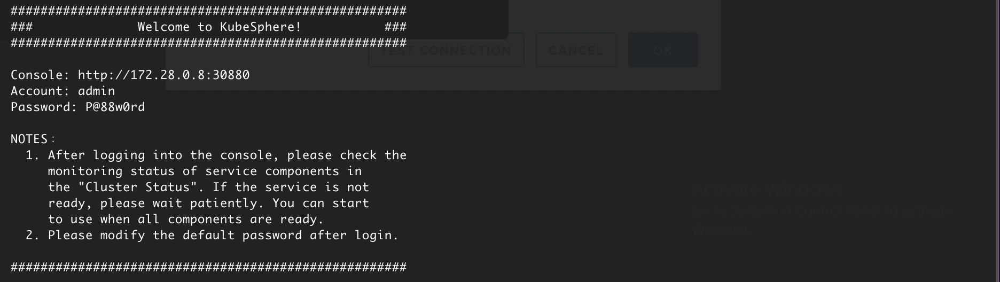

# CICD with PKS @200312

### PKS w/NSX-T on vSphere
  - pks 

### Installation

#### Default Storage Class

```bash
kubectl create -f -<<-EOF
kind: StorageClass
apiVersion: storage.k8s.io/v1
metadata:
  name:  thick
provisioner: kubernetes.io/vsphere-volume
parameters:
  diskformat: zeroedthick
EOF
```
```bash
kubectl patch storageclass <storage-class-name> -p '{"metadata": {"annotations":{"storageclass.kubernetes.io/is-default-class":"true"}}}'

kubectl patch storageclass thick -p '{"metadata": {"annotations":{"storageclass.kubernetes.io/is-default-class":"true"}}}'
```

#### Helm

##### Download CLI version 2
아직 version3 은 호환성면에서 모든 chart를 제공하지 않기 때문에, version 2 사용

```bash
wget https://get.helm.sh/helm-v2.16.4-linux-amd64.tar.gz
```

##### Helm Tiller
``` bash
kubectl apply -f -<<-EOF
apiVersion: v1
kind: ServiceAccount
metadata:
  name: tiller
  namespace: kube-system
---
apiVersion: rbac.authorization.k8s.io/v1beta1
kind: ClusterRoleBinding
metadata:
  name: tiller
roleRef:
  apiGroup: rbac.authorization.k8s.io
  kind: ClusterRole
  name: cluster-admin
subjects:
 - kind: ServiceAccount
   name: tiller
   namespace: kube-system
EOF
```

##### Helm Repo Add (Stable, Incubator)

```bash
helm repo add stable https://kubernetes-charts.storage.googleapis.com
helm repo add incubator https://kubernetes-charts-incubator.storage.googleapis.com/
helm repo add bitnami https://charts.bitnami.com/bitnami

helm repo update
```


#### GOGS for gitserver
```bash
helm install --name gogs --namespace gitserver incubator/gogs \
--set postgresql.persistence.enabled=false \
--set persistence.enabled=false \
--set service.gogs.serverDomain=git.apps.run.haas-205.pez.pivotal.io \
--set service.gogs.serverRootUrl=http://git.apps.run.haas-205.pez.pivotal.io \
--set service.gogs.serviceEnableCaptcha=false \
--set service.ingress.enabled=true \
--set service.ingress.hosts={"git.apps.run.haas-205.pez.pivotal.io"}
```

#### Jenkins 

admin / achc1aQVaZ

###### add bitnami helm repo
```bash
helm repo add bitnami https://charts.bitnami.com/bitnami
```

##### install jenkins with helm 
```bash
helm install --name jenkins --namespace jenkins bitnami/jenkins \
--set jenkinsUser=admin \
--set jenkinsPassword=VMware1! \
--set service.type=ClusterIP \
--set livenessProbe.enabled=false \
--set readinessProbe.enabled=false \
--set ingress.enabled=true \
--set ingress.hostname=jenkins.apps.run.haas-205.pez.pivotal.io
```


#### Kubeapps

- Service Account for kubeapps-operator
```bash
kubectl create serviceaccount kubeapps-operator 

kubectl create clusterrolebinding kubeapps-operator \
--clusterrole=cluster-admin \
--serviceaccount=default:kubeapps-operator

kubectl get secret $(kubectl get serviceaccount kubeapps-operator -o jsonpath='{.secrets[].name}') -o jsonpath='{.data.token}' | base64 --decode
```

- secrets for kubeapps-dashboard
```
eyJhbGciOiJSUzI1NiIsImtpZCI6IiJ9.eyJpc3MiOiJrdWJlcm5ldGVzL3NlcnZpY2VhY2NvdW50Iiwia3ViZXJuZXRlcy5pby9zZXJ2aWNlYWNjb3VudC9uYW1lc3BhY2UiOiJkZWZhdWx0Iiwia3ViZXJuZXRlcy5pby9zZXJ2aWNlYWNjb3VudC9zZWNyZXQubmFtZSI6Imt1YmVhcHBzLW9wZXJhdG9yLXRva2VuLTd3ajJ0Iiwia3ViZXJuZXRlcy5pby9zZXJ2aWNlYWNjb3VudC9zZXJ2aWNlLWFjY291bnQubmFtZSI6Imt1YmVhcHBzLW9wZXJhdG9yIiwia3ViZXJuZXRlcy5pby9zZXJ2aWNlYWNjb3VudC9zZXJ2aWNlLWFjY291bnQudWlkIjoiY2YzY2YzMzUtNGE3NC00MjBmLWFlMjgtNmM1MjZhOGRmY2NlIiwic3ViIjoic3lzdGVtOnNlcnZpY2VhY2NvdW50OmRlZmF1bHQ6a3ViZWFwcHMtb3BlcmF0b3IifQ.tkRDCveIKZb0vUXbgZRBI3UqkjXZtpUgUHeOkpXS8mAQqPvFD2H259Id2zCC2nTJLc2hNb0GZw2TcYYvZ5misKkzi2fPE2NEZ3wtcwp2ZQXzK6Vv2SUI4NxbjgqCQEktIeupbvamDIzzEeCRHue8LOLy-o5EWXIcYDX5AxSH3-8uBW74bmXN35BnQjWkVajO4xFM9lFuSVS9ekK1k33Fo82KOSo3VGgkmDvMuZql9oweZTKYGiBe17nbuG03IBXxngM_UIUC_DqxJ3kHzUhfxhaMkQ8L_asGaH9pNhLxoQULx49LgDwNnh5bxVbJZmOSMdmMSLj4RmjucyvRmWgarw
```
- Install the kubeapps
```bash
helm install --name kubeapps --namespace kubeapps bitnami/kubeapps \
--set frontend.service.type=LoadBalancer \
--set mongodb.securityContext.enabled=false \
--set mongodb.mongodbEnableIPv6=false
```


- access with browser to http://10.195.70.144


#### Nexus through kubeapps


* 설치 후 nexus.apps.run.haas-205.pez.pivotal.io 에서 이미지가 제대로 보이지 않는 문제가 있어서, Ingress 에서 path /*를 삭제 후 정상 기동


#### kubesphere
- Installing kubsphere 
```bash
kubectl apply -f https://raw.githubusercontent.com/kubesphere/ks-installer/master/kubesphere-complete-setup.yaml
```

- Verify the access
```bash
kubectl logs -n kubesphere-system $(kubectl get pod -n kubesphere-system -l app=ks-install -o jsonpath='{.items[0].metadata.name}') -f
```



  - username : admin
  - password : P@88w0rd --> VMware1!

- Access the kubesphere with browser

- Ingress for kubersphere

```bash
kubectl apply -f -<<-EOF
apiVersion: networking.k8s.io/v1beta1
kind: Ingress
metadata:
  name: kubesphere-ingress
  namespace: kubesphere-system
spec:
  rules:
  - host: kubesphere.apps.run.haas-205.pez.pivotal.io
    http: 
      paths:
      - backend:
          serviceName: ks-console
          servicePort: 80
EOF
```


#### Contour
Ingress Controller based on envoy

- Installing Contour
```baah
kubectl apply -f https://j.hept.io/contoure-deployment-rbac
```

#### MetalLB
provides a network load-balancer implementation for kubernetes clusters
Layer2 configuration mode of MetalLB

- Installing MetalLB
```bash
kubectl apply -f https://raw.githubusercontent.com/google/metallb/v0.8.3/manifests/metallb.yaml
```

- Components of MetalLB
  - metallb-system/controller
  - metallb-system/speaker

- Congiguration
  - Layer2 Configuration
  - BGP Configuration
  - Advertisement Configuration


